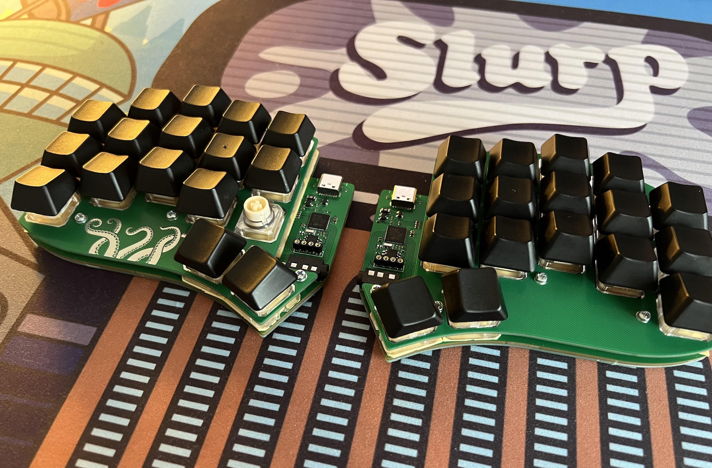

# Tako

> **Warning**
> There are no tentacles like the ones in the picture on the current production files for the top plate.

  
  
  

---

Tako is a vertical stagger split keyboard with electrostatic capacitive (EC) non-contact switches.

## Status

It's the first prototype I made, and it works as expected. However, it's a 4-layer PCBA-only board, so it can be quite expensive if you only want a single keyboard. Currently, I am working on a DIY version using [STeMCell](https://github.com/megamind4089/STeMCell) and hopefully [nice!nano](https://nicekeyboards.com/nice-nano) with hand-solderable components (SOIC and 0805). Support for nice!view is also planned.

There is nothing wrong with the assembled version, though. It's a good choice if you don't want to solder that much and ideally have someone who wants a second set (on JLCPCB, you can get assembly for 2/5 PCBs).

## Features

### Assembled version

- Onboard USB-C with ESD protection
- STM32F4x1 MCU
- Actuation Point Changer
- USART Full-duplex
- [OLED](./img/assembled_oled.jpg) support

## Caveats

- No tenting puck support since there is no space between housings for screw holes. But could be done on bottom plate with different case design.

## BOM

### EC Parts

| Part            | Amount |
| --------------- | ------ |
| Housings        | 34     |
| Domes           | 34     |
| Conical springs | 34     |
| Sliders         | 34     |

You can obtain all of this on [deskeys](https://deskeys.io/). Please read all the notes and warnings below.

> **Note**
> If you going to use DES V3/Carrot domes then it's recommended to get DES Volcano springs to avoid sping crunch.

---

> **Note**
> Silencing rings are recommended. If you want the same key travel as HHKB Type-S with DES housings and DES sliders then you should get #7 rings.

---

> **Warning**
> I tested only with DES housings and used 14.7x14.1mm cutouts recommended by DES while original Topre often use 14.6x14mm. Original Topre housings should work just fine as well.

### Top plate

Currently, you can only use MX-compatible sliders due to the housing orientation. Topre housings are designed for row stagger, and if you intend to use the same orientation for vertical stagger, you can't use dome strips, and there is no spacing between housings for screws. At the same time Topre sliders only allow one way keycap orientation. Therefore, if you use the current top plate with Topre sliders, your keycaps will end up at a 90-degree angle.

I am planning to add more top plate options soon.

- [x] Default - housings rotated 90deg.
- [ ] Normal housing horientation. Compatible with Topre sliders. No mounting holes between housings, domes should be cut for each key instead of using 3x strips.
- [ ] NiZ

### Assembled version

| Part           | Amount | Details                                                                                                                                                                                         |
| -------------- | ------ | ----------------------------------------------------------------------------------------------------------------------------------------------------------------------------------------------- |
| Assembled PCB  | 1      | 1.6mm                                                                                                                                                                                           |
| Top plate      | 2      | 1.2mm thickness! See top plate section for details.                                                                                                                                             |
| Bottom plate   | 2      | 1.6mm                                                                                                                                                                                           |
| M2x6 standoffs | 16     | Max OD 3.3mm. [This](https://aliexpress.com/item/32975966103.html?sku_id=66665375911) and [this](https://aliexpress.com/item/1005003126118423.html?sku_id=12000024241636343) confirmed to work. |
| M2x4 screws    | 32     |                                                                                                                                                                                                 |
| PJ-320A        | 2      | Audio jack                                                                                                                                                                                      |
| TRRS Cable     | 1      |                                                                                                                                                                                                 |

> **Warning** **Top plate should be 1.2mm thick!**

#### Optional

| Part         | Amount |
| ------------ | ------ |
| 128x32 OLED  | 2      |
| OLED Sockets | 2      |

#### Optional mounting

There are also mounting holes between housings on 1, 3, and 5 columns. They are not required, and it should be fine not to use them. However, in case you experience some "squishing" sounds, especially on the homerow, it is likely that the housings are not sitting properly on the PCB. You should try to re-assemble keyboard first to ensure domes and springs aligned properly.

In case you re-assembled it few times and sure everything is ok, you'll need to add mounting somewhere at the center of the keyboard. There is no space for M2 standoffs between the housings, so you should use M1.6 (max OD is 2.5mm) or just a long M2 screw (around 11mm) with a nut on the bottom plate.

| Part             | Amount | Details                                                                                                                       |
| ---------------- | ------ | ----------------------------------------------------------------------------------------------------------------------------- |
| M1.6x6 standoffs | 12     | [Aliexpress](https://aliexpress.ru/item/4000582961951.html?spm=a2g2w.orderdetail.0.0.72ee4aa6N6dYoc&sku_id=10000003716437218) |
| M1.6x4 screws    | 24     |                                                                                                                               |

## Build guide

Coming soon.

## Firmware

At the moment, only QMK is supported. While ZMK in wired mode is possible, it has not been implemented yet, and there is no guarantee that it will be.

## Thanks

Special thanks to [Cipulot](https://github.com/Cipulot/) for all the work on EC keyboards and assistance.

- [jimmerricks](https://github.com/jimmerricks/swoop) for Swoop
- [duckyb](https://github.com/duckyb/urchin) for Urchin I was inspired by
- Awesome [Pete Johanson](https://github.com/petejohanson) for assistance
